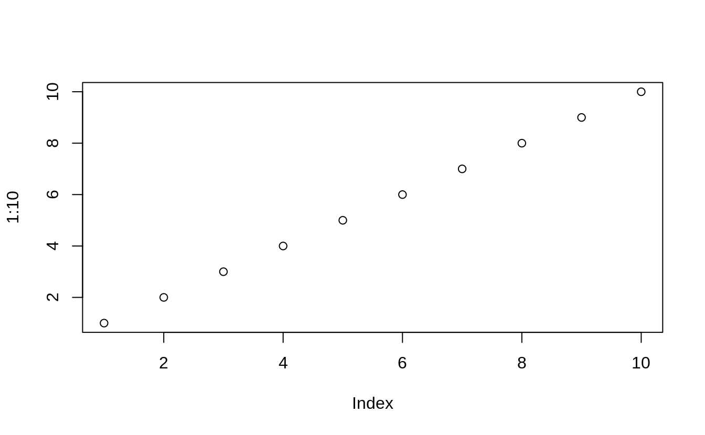

Nice subsection
---------------

[A link](https://masalmon.eu)

Some inline code, `curl::ok()`.

<pre class='chroma'><code class='language-r' data-lang='r'>usethis::<a href='https://usethis.r-lib.org/reference/use_git.html'>use_git</a>()
ggplot(mtcars)
<a href='https://rdrr.io/r/graphics/plot.html'>plot</a>(1:19)
a &lt;- TRUE</code></pre>

<pre class='chroma'><code class='language-r' data-lang='r'><a href='https://rdrr.io/r/graphics/plot.html'>plot</a>(1:10)
</code></pre>

A plot showing blabla

