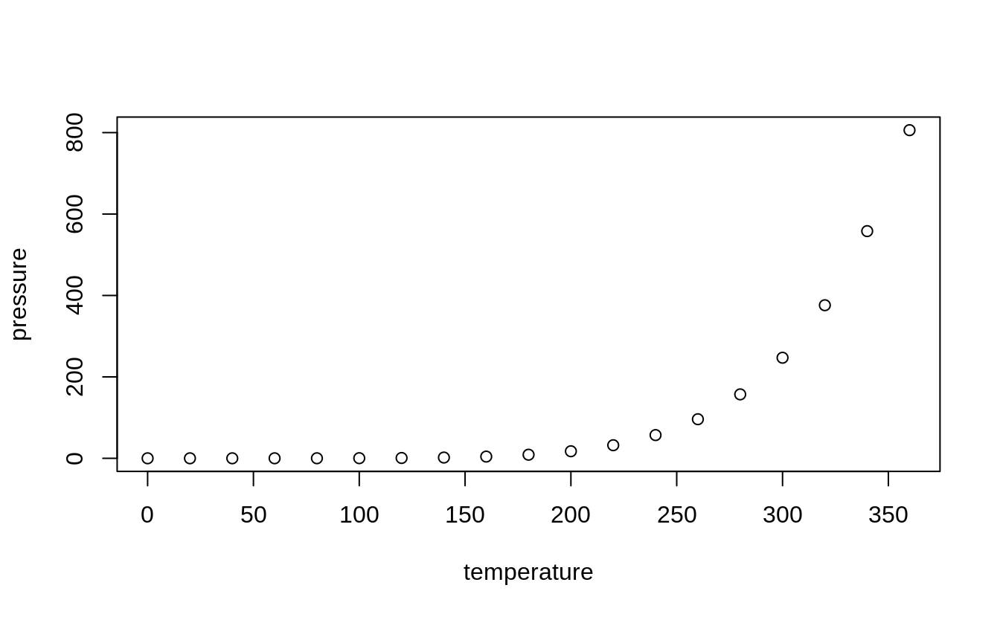
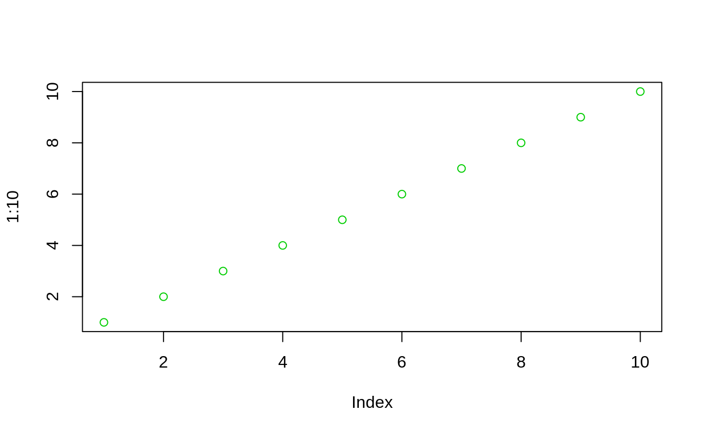

R Markdown
----------

A citation[^1]. R is cool[^2].

This is an R Markdown document. Markdown is a simple formatting syntax for authoring HTML, PDF, and MS Word documents. For more details on using R Markdown see <a href="http://rmarkdown.rstudio.com" class="uri">http://rmarkdown.rstudio.com</a>.

When you click the **Knit** button a document will be generated that includes both content as well as the output of any embedded R code chunks within the document. You can embed an R code chunk like this:

<pre class='chroma'><code class='language-r' data-lang='r'><a href='https://rdrr.io/r/base/summary.html'>summary</a>(cars)
#&gt;      speed           dist       
#&gt;  Min.   : 4.0   Min.   :  2.00  
#&gt;  1st Qu.:12.0   1st Qu.: 26.00  
#&gt;  Median :15.0   Median : 36.00  
#&gt;  Mean   :15.4   Mean   : 42.98  
#&gt;  3rd Qu.:19.0   3rd Qu.: 56.00  
#&gt;  Max.   :25.0   Max.   :120.00</code></pre>

Including Plots
---------------

You can also embed plots, for example:

Note that the `echo = FALSE` parameter was added to the code chunk to prevent printing of the R code that generated the plot.

Another plot
------------

<pre class='chroma'><code class='language-r' data-lang='r'><a href='https://rdrr.io/r/graphics/plot.html'>plot</a>(1:10, col = 3)
</code></pre>

Some other thing
----------------

<pre class='chroma'><code class='language-r' data-lang='r'><a href='https://rdrr.io/r/base/MathFun.html'>sqrt</a>(4)
#&gt; [1] 2</code></pre>

[^1]: Rich FitzJohn et al., *Jqr: Client for 'Jq', a 'Json' Processor*, 2018, <https://CRAN.R-project.org/package=jqr>.

[^2]: R Core Team, *R: A Language and Environment for Statistical Computing* (Vienna, Austria: R Foundation for Statistical Computing, 2020), <https://www.R-project.org/>.

